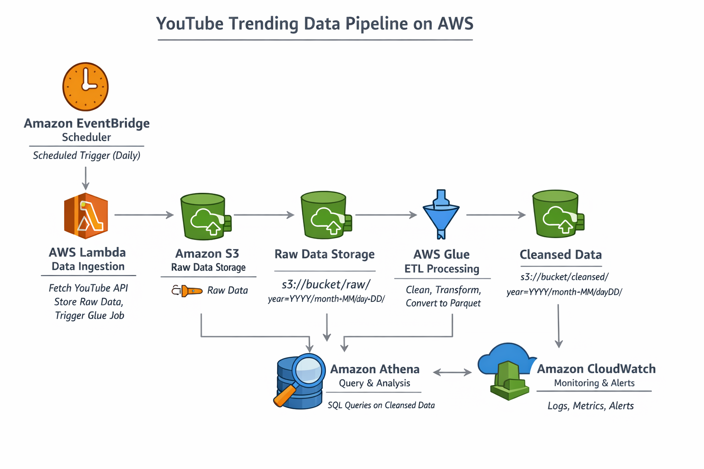
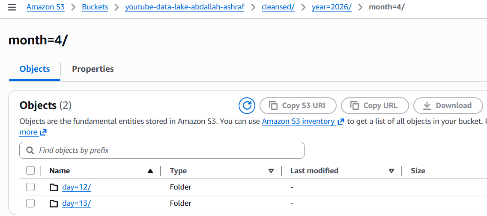

# 📊 YouTube Trending Data Pipeline (AWS Serverless)

## 🚀 Overview
This project is a fully serverless data engineering pipeline built on AWS that extracts trending YouTube videos, processes the data, and enables analytical queries using Athena.

The system is designed using a modern **data lake architecture** with automation, orchestration, and monitoring.

---

## 🏗️ Architecture

The pipeline follows this flow:

EventBridge → Lambda → S3 (Raw) → Glue ETL → S3 (Cleansed) → Athena → CloudWatch


---

## ⚙️ Tech Stack

- AWS Lambda (Data ingestion & orchestration)
- AWS Glue (ETL processing)
- Amazon S3 (Data Lake storage)
- Amazon Athena (SQL analytics)
- Amazon CloudWatch (Monitoring & metrics)
- Amazon EventBridge (Scheduling)
- YouTube Data API

---

## 📦 Data Pipeline Steps

### 1. Data Ingestion
- Lambda fetches trending videos from YouTube API
- Stores raw JSON in S3 (partitioned by date)

### 2. ETL Processing
- Glue job reads raw JSON
- Cleans and transforms data
- Converts to Parquet format
- Stores in partitioned structure

### 3. Analytics Layer
- Athena queries Parquet data directly from S3
- Supports fast SQL-based analysis

### 4. Monitoring
- CloudWatch tracks:
  - Pipeline success rate
  - Data volume processed
  - Failure alerts

---

## 📂 Data Structure
```
s3://bucket/
│
├── raw/
│ └── year=YYYY/month=MM/day=DD/
│
├── cleansed/
│ └── year=YYYY/month=MM/day=DD/
│
└── athena-results/
```


## 📊 Example Queries

### Top Trending Videos
```sql
SELECT title, views
FROM youtube_trending
ORDER BY views DESC
LIMIT 10;
```
### Most Active Channels
```sql
SELECT channel, COUNT(*) AS videos
FROM youtube_trending
GROUP BY channel
ORDER BY videos DESC;
```

---

## 🔐 Security

- IAM roles follow the least privilege principle
- Separate roles for Lambda and Glue
- No hardcoded credentials (environment variables used)

---
📈 Key Features
- Fully serverless architecture
- Automated daily pipeline
- Partitioned data lake design
- Scalable ETL processing
- Monitoring via CloudWatch
---
🧠 Key Learnings
- Data lake architecture design
- AWS serverless orchestration
- ETL pipeline development
- IAM role management
- Cloud monitoring & observability
---
🚀 Future Improvements
- Add real-time streaming (Kinesis)
- Add data quality validation layer
- Add CI/CD pipeline (GitHub Actions)
- Add dashboarding (QuickSight)
---
👨‍💻 Author

Abdallah Ashraf Ismail


---

